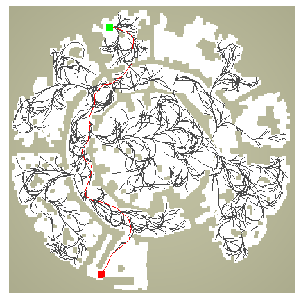
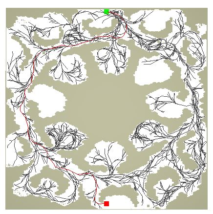

# Briefing
Sample Based Motion Planning. Work in Progress.

This project is intended as educational replication of several general ideas:
- Sparcity
- Motion Primitives
- Importance Sampling

A sub-goal of this project is to integrate and leverage benefits of several of these ideas in a hybrid solution.

Inputs to program
- system dynamics and various constraints are supplied as functions
- environment obstacles

# Progress:
- Sparcity:
  - implemented core algorithm of Stable Sparse RRT (https://www.cs.rutgers.edu/~kb572/pubs/stable_sparse_rrt_WAFR14_LLB.pdf)
  - approximate nearest neighbour with stochastic search, optional compile flag for linear nearest neighbour search
- Motion Primitives:
  - lookup for feasible control for steering toward a direction (https://arxiv.org/pdf/1809.02399.pdf)
  - compile flag for enabling its use;
  - adapted for run-time lookup filling
  - non-grid based greedy goal-neighbourhood search
  - [TODO] sparse lookup storage
- Importance Sampling:
  - [TODO] use of entropy based sampler for shifting towards better parameterization (https://journals.sagepub.com/doi/pdf/10.1177/0278364912444543)
  
# Running Planner
* prerequisites
  * install Rust: https://rustup.rs/
  * internet connection (building project pulls in software dependencies)
  * Make (to build triangulation tool if using custom maps, or obtain executable at: https://www.cs.cmu.edu/~quake/triangle.html)
* build and run in release mode
  * Either:
    * have custom maps already generated (see Generating Custom Maps section)
    * -p \<problem instance name> (eg: -p obs3 ), see prob_instances.rs for predefined problem domain list
  * Or:
    * -o \<file_obstacle>: obstacle file path (eg: -o obstacles/obs2.txt (randomly generated boxes)
  * Or:
    * have custom maps already generated (see Generating Custom Maps section)
    * -e \<.ele file path> -n \<.node file path> (see custom maps section) -m \<model>
* optional arguments:
  * -w: show witness node and witness representative pairs
      * drawn as a line(red) with end points (purple: witness), (blue: witness representative)
  * -i \<N>: max iterations
  * -m \<model>: model selection, defaults to dubins (some parameters overriden by src/prob_instances.rs)
      * \<model> variants:
      	- dubins, airplane (TODO)
  * -b \<N>: batch N iterations in between rendering calls
  * -h: help
* optional compile-time features:
  * usage:
    * cargo run --release --bin planner --features nn_naive,disable_pruning,(other features...) -- -p <problem_instance_name> (other program arguments)...
  * variants:
    * motion_primitives (enables motion_primitive)
    * runge_kutta (alternative RK4 propagation method, default is Euler)
    * disable_pruning (make the propagation tree non-sparse)
    * nn_naive (use linear search for nearest neighbour query)
    * nn_sample_log (use logarithmic number of stochastic samples for nn query, must not have nn_naive to have effect, defaults to square root number of stochastic samples)
    * mo_prim_debug (render all candidates for motion primitives)
    * mo_prim_thresh_low/high (low and high neighbourhood threshold for motion primitive activation)

# Generating Random Obstacles (a couple obstacles exists in obstacles/ folder)
* build and run in release mode with: cargo run --release --bin gen_obs -- -f \<output_file_path>
* required arguments:
  * -f \<output_file_path> (eg: cargo run --release --bin gen_obs -- -f obstacles/obs99.txt)
* optional arguments:
  * -n \<N>: number of obstacles to be generated (default: 30)
  
# Using Random Obstacles
* cargo run --release --bin planner -- -o <file_obstacle>
  * -o \<file_obstacle>: obstacle file path (eg: -o obstacles/obs2.txt)
    
# Generating Custom Maps (need to run this once in order to use custom maps):
* a set of maps that is mainly used for benchmarking purposes obtainable from https://www.movingai.com/benchmarks/grids.html can be used, these are located in the /maps_custom folder
* character movable space within a map are triangulated for use in the planner as the configuration free space
* triangulation is done using the awesome Triangle software from http://www.cs.cmu.edu/~quake/triangle.html
* the maps are converted into a format for Triangle to process and output is loadable into our planner and further extruded as triangular prisms for use with a general purpose 3D obstacle detector, these intermediate files are stored at /maps_custom/<game>/poly
* some maps might have bad triangulation not useable for the planner (I aimed for working with Dragon Age maps)
* generating intermediate files and map assets for our planner
  * 1st, compile Triangle
    * cd Triangle_v1_6
    * make
  * 2nd, run ./script_map2poly.sh (generates formatted file for Triangle, may take a while)
  * 3rd, run ./script_triangulate_poly.sh (outputs 2D triangulation result as .ele and .node files)
  * all set for use...
  
# Using Custom Maps
* build and run planner with custom maps in release mode:
  * Either (recommended): cargo run --release --bin planner -- -p \<problem_instance_name> (see src/prob_instances.rs)
  * Or: cargo run --release --bin planner -- -e \<.ele file path> -n \<.node file path> -m \<model>(edit appropriate model file for different source/goal states)
    * (eg: cargo run --release --bin planner -- -e maps_custom/dragon_age/poly/ost100d.1.ele -n maps_custom/dragon_age/poly/ost100d.1.node -p ost100d -i 500000 -m dubins

# Screenshots
## Randomly Generated Boxes

   

## Maps from Dragon Age

   
   
   
   
   

