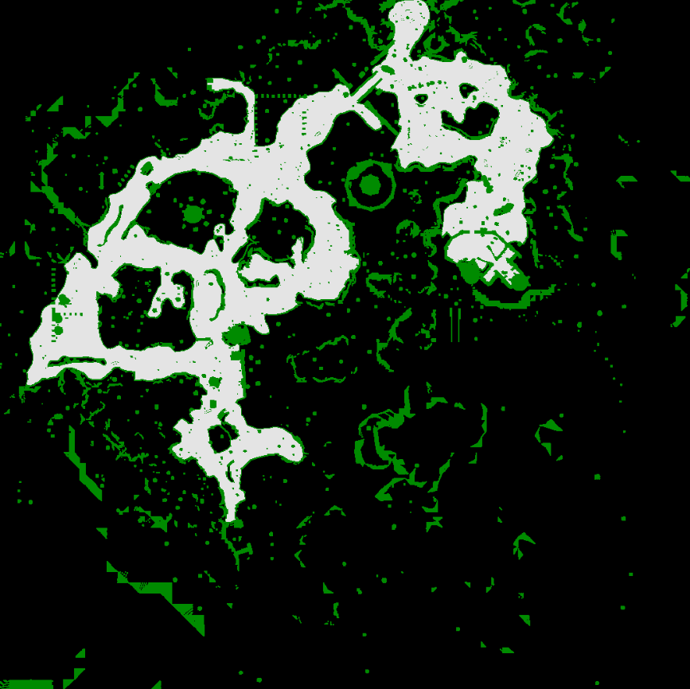
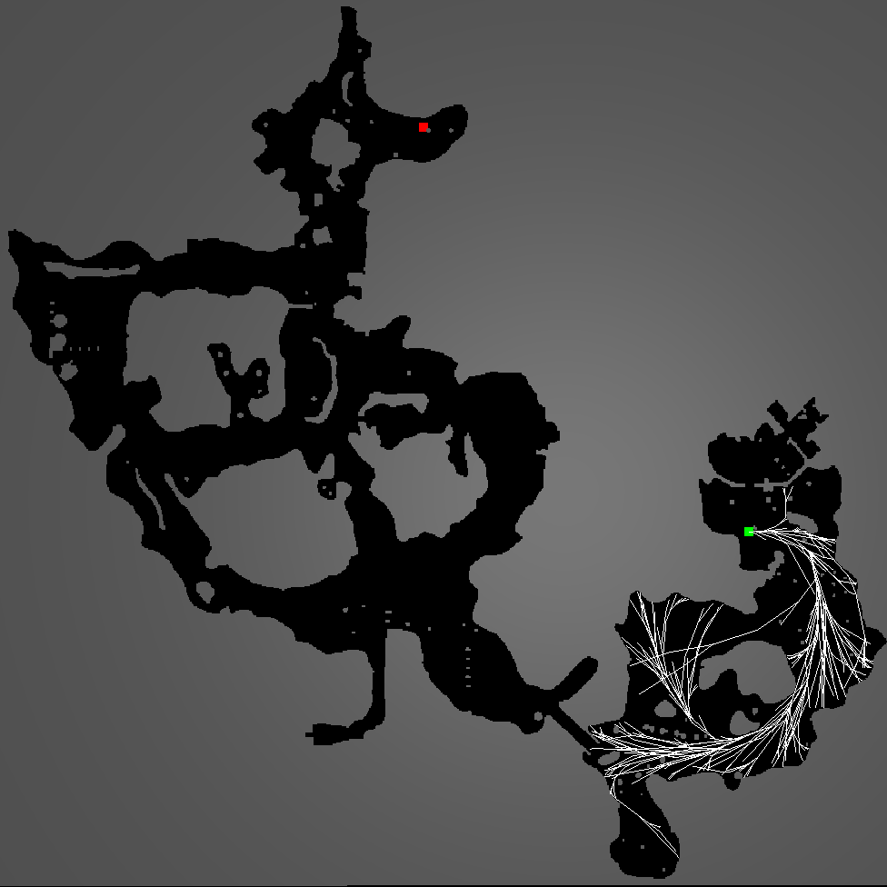
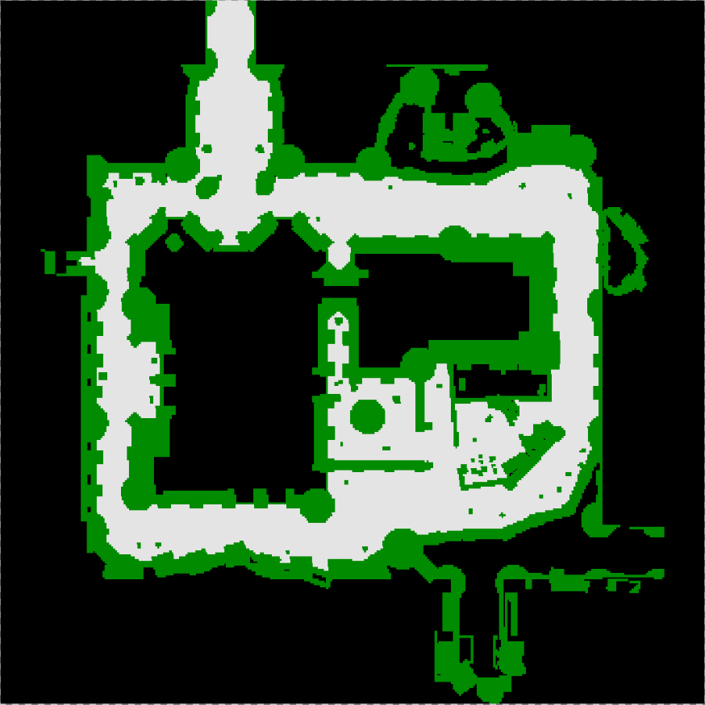
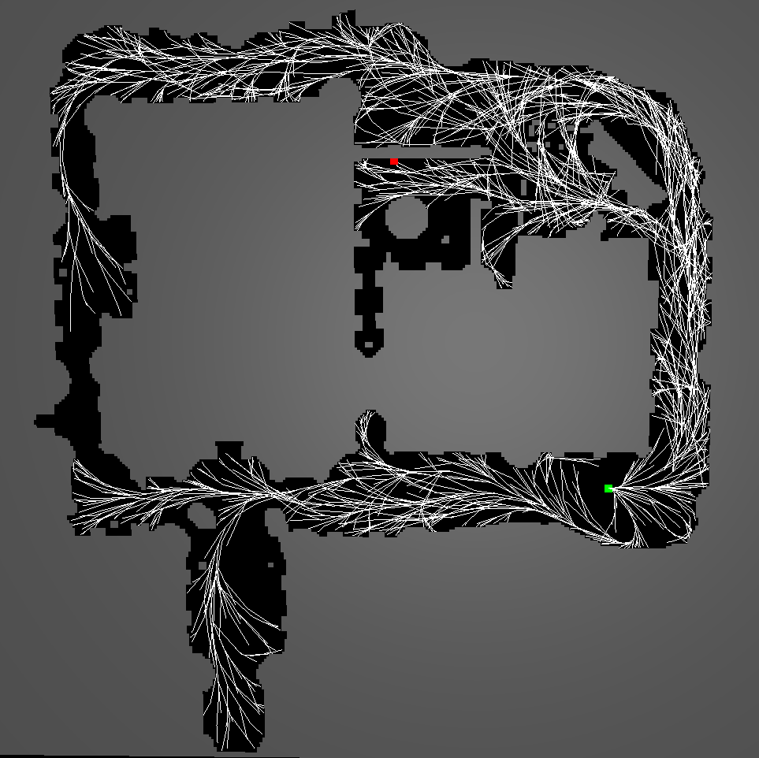

# Briefing
Sample Based Motion Planning. Work in Progress.

This project is intended as educational replication of several general ideas:
- Sparcity
- Motion Primitives
- Importance Sampling

A sub-goal of this project is to integrate and leverage benefits of several of these ideas in a hybrid solution.

Inputs to program
- system dynamics and various constraints are supplied as functions
- environment obstacles

# Progress:
- Sparcity:
  - implemented core algorithm of Stable Sparse RRT (https://www.cs.rutgers.edu/~kb572/pubs/stable_sparse_rrt_WAFR14_LLB.pdf)
- Motion Primitives:
  - [Work in Progress] lookup for feasible control for steering toward a direction (https://arxiv.org/pdf/1809.02399.pdf)
- Importance Sampling:
  - [TODO] use of entropy based sampler for shifting towards better parameterization (https://journals.sagepub.com/doi/pdf/10.1177/0278364912444543)
- Others
  - [TODO] a better nearest neighbour query with runtime add/deletion
  
# Running Planner
* build and run in release mode with: cargo run --release --bin planner -- [-o \<file_obstacle> | -e \<.ele file path> -n \<.node file path> ]
* required arguments:
  * -o \<file_obstacle>: obstacle file path (eg: cargo run --release --bin planner -- -o obstacles/obs1.txt), or
  * -e \<.ele file path> -n \<.node file path> (see custom maps section)
* optional arguments:
  * -w: show witness node and witness representative pairs (cargo run --release --bin planner -- -w)
      * drawn as a line(red) with end points (purple: witness), (blue: witness representative)
  * -i \<N>: max iterations (cargo run --release --bin planner -- -i \<N>)
  * -m \<model>: model selection (cargo run --release --bin planner -- -m \<model>), defaults to dubins
      * \<model> variants: dubins
  * -h: cargo run --release --bin planner -- --h

# Running Obstacle Generator
* build and run in release mode with: cargo run --release --bin gen_obs -- -f \<output_file_path>
* required arguments:
  * -f \<output_file_path> (eg: cargo run --release --bin gen_obs -- -f obstacles/obs99.txt)
* optional arguments:
  * -n \<N>: number of obstacles to be generated (default: 30)
  * -h: cargo run --release --bin gen_obs -- --h

# Using custom maps
* a set of maps that is mainly used for benchmarking purposes obtainable from https://www.movingai.com/benchmarks/grids.html can be used, these are located in the /maps_custom folder
* character movable space within a map are triangulated for use in the planner as the configuration free space
* triangulation is done using Triangle software from http://www.cs.cmu.edu/~quake/triangle.html
* the maps are converted into a format for Triangle to process and output is loadable into our planner, these intermediate files are stored at /maps_custom/<game>/poly
* some maps might have bad triangulation not useable for the planner
* build and run in release mode with: cargo run --release --bin planner -- -e \<.ele file path> -n \<.node file path>
  * (eg: cargo run --release --bin planner -- -e maps_custom/dragon_age/poly/ost100d.1.ele -n maps_custom/dragon_age/poly/ost100d.1.node -i 500000
* required arguments:
  * -e \<.ele file path>
  * -n \<.node file path>

# Screenshots

   

## Maps from Dragon Age and its post-processed versions in planner

   
   
   	
   		

