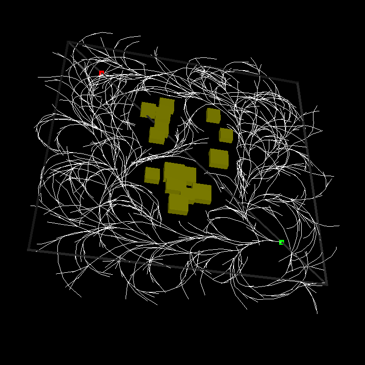

# Briefing
Sample Based Motion Planning. Work in Progress.

This project is intended as educational replication of several general ideas:
- Sparcity (Eg: Stable Sparse RRT)
- Motion Primitives
- Importance Sampling

A sub goal of this project is to integrate and leverage benefits of several of these ideas in a hybrid solution.

Inputs to program
- system dynamics and various constraints are supplied as functions
- [TODO] environment obstacles are suppled in some format

# Progress
- Sparcity:
  - implemented core algorithm of Stable Sparse RRT (https://www.cs.rutgers.edu/~kb572/pubs/stable_sparse_rrt_WAFR14_LLB.pdf)
- Importance Sampling:
  - [TODO] use of entropy based sampler for shifting towards better parameterization (https://journals.sagepub.com/doi/pdf/10.1177/0278364912444543)
- Motion Primitives:
  - [TODO] lookup for feasible control for steering toward a direction (https://arxiv.org/pdf/1809.02399.pdf)
- Collision:
  - [TODO] investigate and select collision detection library/algorithm (currently uses naive algo as placeholder).
  
# Running Planner
* build and run in release mode with: cargo run --release --bin planner -- -o <file_obstacle>
* required arguments:
  * -o <file_obstacle>: obstacle file path (eg: cargo run --release --bin planner -- -o obstacles/obs1.txt)
* optional arguments:
  * -w: show witness node and witness representative pairs (cargo run --release --bin planner -- -w)
      * drawn as a line(red) with end points (purple: witness), (blue: witness representative)
  * -i <N>: max iterations (cargo run --release --bin planner -- -i <N>)
  * -m <model>: model selection (cargo run --release --bin planner -- -m <model>), defaults to dubins
      * <model> variants: dubins
  * -h: cargo run --release --bin planner -- --h

# Running Obstacle Generator
* build and run in release mode with: cargo run --release --bin gen_obs -- -f <output_file_path>
* required arguments:
  * -f <output_file_path> (eg: cargo run --release --bin gen_obs -- -f obstacles/obs99.txt)
* optional arguments:
  * -n <N>: number of obstacles to be generated (default: 30)
  * -h: cargo run --release --bin gen_obs -- --h

   

